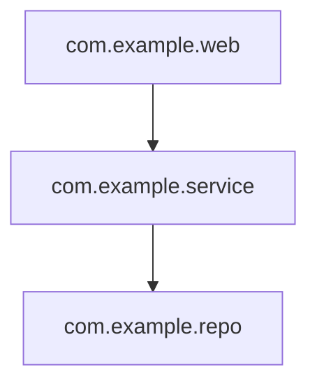

# Hephaestus

Hephaestus is an AI-assisted architecture explorer for Java applications.

The project starts from deterministic static analysis: it imports a local Java project,
parses source code, stores architecture facts, and exposes query APIs over those facts.
Future AI features should explain and summarize the stored facts, not invent them.

> Facts come from code. Explanations come from AI.

## Current Scope

The current slice supports:

- Importing a local Java project path.
- Parsing Java source with JavaParser.
- Persisting repositories, source files, symbols, and dependencies in H2 via JPA.
- Querying symbols, dependencies, and dependents.
- Returning deterministic architecture summaries.
- Returning Mermaid dependency diagrams for package and class scopes.

The current slice intentionally does not include:

- Git cloning or branch management.
- AI chat, summaries, or embeddings.
- Source-code modification.
- Mermaid rendering UI.
- External database setup.

## Requirements

- Java 21
- Bash-compatible shell for `./mvnw`

Maven does not need to be installed globally; this repository includes a Maven wrapper.

## Run

```bash
./mvnw spring-boot:run
```

By default, the application uses an in-memory H2 database configured in
`src/main/resources/application.yml`.

## Test

```bash
./mvnw test
```

## API

The API is currently local-filesystem oriented. Import paths must be absolute paths
to existing local directories.

### Import a Local Repository

```bash
curl -X POST http://localhost:8080/api/repositories/import-local \
  -H 'Content-Type: application/json' \
  -d '{"path":"/absolute/path/to/java/project"}'
```

### Index a Repository

```bash
curl -X POST http://localhost:8080/api/repositories/{repositoryId}/index
```

### Search Symbols

```bash
curl 'http://localhost:8080/api/repositories/{repositoryId}/symbols?name=PaymentService'
```

### Query Dependencies

```bash
curl http://localhost:8080/api/symbols/{symbolId}/dependencies
curl http://localhost:8080/api/symbols/{symbolId}/dependents
```

### Architecture Summary

```bash
curl http://localhost:8080/api/repositories/{repositoryId}/architecture-summary
```

### Query Spring Endpoints

```bash
curl http://localhost:8080/api/repositories/{repositoryId}/endpoints
curl 'http://localhost:8080/api/repositories/{repositoryId}/endpoints?path=/api/files'
```

### Mermaid Dependency Diagrams

```bash
curl 'http://localhost:8080/api/repositories/{repositoryId}/diagrams/dependencies?scope=package'
curl 'http://localhost:8080/api/repositories/{repositoryId}/diagrams/dependencies?scope=class'
```

The response contains Mermaid text, for example:



## Architecture

Hephaestus is a Spring Boot Maven modular monolith with package root
`me.acharliekelly.hephaestus`.

Current modules:

- `repo`: validates and imports local repository paths.
- `indexing`: scans `.java` files and extracts static architecture facts.
- `graph`: answers deterministic graph queries and produces summaries/diagrams.
- `model`: JPA entities and repositories.
- `web`: REST controllers and API response types.

Architecture decisions are recorded in `docs/adr/`.

## Development Notes

- Keep deterministic analysis as the source of truth.
- Add or update ADRs for material changes to architecture, persistence, public APIs,
  static analysis strategy, AI orchestration, or module boundaries.
- Prefer small vertical slices with tests over broad unverified changes.
